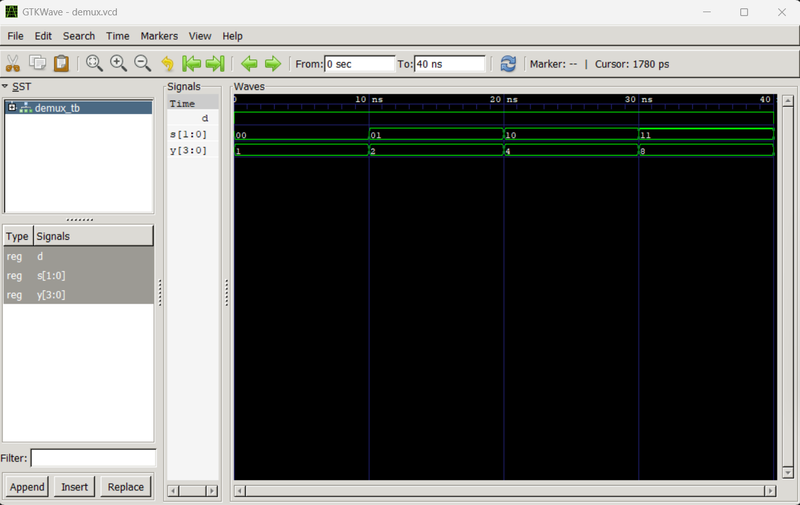

# Lab 4: VHDL Code for Combinational

Circuits (MUX and DEMUX)

---

## Objective

- To design and simulate a **4-to-1 Multiplexer (MUX)** in VHDL.
- To design and simulate a **1-to-4 Demultiplexer (DEMUX)** in VHDL.

---

## Theory

### Multiplexer (MUX)

A multiplexer is a combinational circuit that selects one of \(2^n\) input lines and routes it to a single output based on **n select lines**.

A **4-to-1 MUX** has:

- 4 data inputs: D0, D1, D2, D3
- 2 select lines: S1, S0
- 1 output: Y

| S1  | S0  | Output |
| --- | --- | ------ |
| 0   | 0   | D0     |
| 0   | 1   | D1     |
| 1   | 0   | D2     |
| 1   | 1   | D3     |

---

### Demultiplexer (DEMUX)

A demultiplexer routes a single input to one of \(2^n\) output lines based on select lines.

A **1-to-4 DEMUX** has:

- 1 input: D
- 2 select lines: S1, S0
- 4 outputs: Y0–Y3

| S1  | S0  | Active Output |
| --- | --- | ------------- |
| 0   | 0   | Y0 = D        |
| 0   | 1   | Y1 = D        |
| 1   | 0   | Y2 = D        |
| 1   | 1   | Y3 = D        |

---

## Output

### 4-to-1 Multiplexer Simulation

The waveform shows correct selection of inputs based on select lines. Each combination of S1 and S0 correctly routes the corresponding input to output Y.

---

### 1-to-4 Demultiplexer Simulation

The waveform verifies correct routing of input D to one of the four outputs based on select lines, while all other outputs remain inactive.

---

## Discussion

The VHDL implementation of both the 4-to-1 Multiplexer and 1-to-4 Demultiplexer was successfully verified using GHDL and GTKWave. The observed waveforms match the theoretical truth tables, confirming correct combinational behavior.

The use of behavioral modeling with `case` statements ensured a simple and efficient design approach.

---

## Conclusion

Both circuits were successfully designed and simulated using VHDL. The results confirm correct functionality of multiplexing and demultiplexing operations, reinforcing the understanding of combinational logic design using hardware description language.
