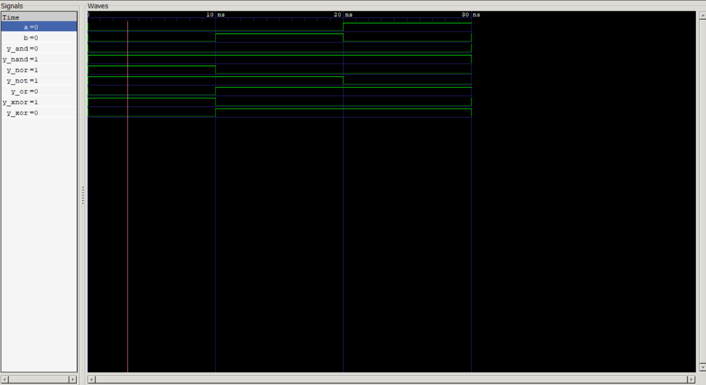

# Lab 2: Implementation and Simulation of Basic Logic Gates Using VHDL

## 1. Objective

The objectives of this experiment are:

* Design and implement the seven fundamental digital logic gates using VHDL:

  * AND
  * OR
  * NOT
  * NAND
  * NOR
  * XOR
  * XNOR
* Develop testbenches to verify the functionality of each gate.
* Simulate the designs using GHDL.
* Analyze the resulting waveforms using GTKWave.
* Compare simulation outputs with the expected Boolean logic behavior.

---

## 2. Theoretical Background

Logic gates are the basic building blocks of digital electronic systems. They perform logical operations on binary inputs and generate outputs according to the rules of Boolean algebra. Every digital system, from simple combinational circuits to modern processors, is built using combinations of these gates.

VHDL provides built-in logical operators that directly correspond to hardware logic gates, making circuit descriptions concise and intuitive.

### Basic Logic Gates

| Gate | Function                                       |
| ---- | ---------------------------------------------- |
| AND  | Output is HIGH only when all inputs are HIGH   |
| OR   | Output is HIGH when at least one input is HIGH |
| NOT  | Inverts the input signal                       |
| NAND | Inverse of AND operation                       |
| NOR  | Inverse of OR operation                        |
| XOR  | Output is HIGH when inputs are different       |
| XNOR | Output is HIGH when inputs are identical       |

NAND and NOR gates are known as **universal gates** because any digital logic function can be implemented using only one of these gate types. XOR and XNOR gates are commonly used in arithmetic circuits, parity generators, comparators, and error-detection systems.

---

## 3. Implementation

The logic gates were implemented using the **Dataflow Modeling** style in VHDL. In this approach, outputs are assigned directly through concurrent signal assignment statements, closely representing actual hardware behavior.

### VHDL Design

```vhdl
library IEEE;
use IEEE.STD_LOGIC_1164.ALL;

entity LOGIC_GATES is
    port (
        A : in std_logic;
        B : in std_logic;
        Y_AND  : out std_logic;
        Y_OR   : out std_logic;
        Y_NOT  : out std_logic;
        Y_NAND : out std_logic;
        Y_NOR  : out std_logic;
        Y_XOR  : out std_logic;
        Y_XNOR : out std_logic
    );
end entity LOGIC_GATES;

architecture Dataflow of LOGIC_GATES is
begin
    Y_AND  <= A and B;
    Y_OR   <= A or B;
    Y_NOT  <= not A;
    Y_NAND <= A nand B;
    Y_NOR  <= A nor B;
    Y_XOR  <= A xor B;
    Y_XNOR <= A xnor B;
end architecture Dataflow;
```

### Simulation Procedure

1. Write the VHDL design for the logic gates.
2. Create a testbench to apply all possible input combinations.
3. Compile the design and testbench using GHDL.
4. Run the simulation to generate waveform data.
5. Open the generated waveform file in GTKWave for analysis.

---

## 4. Results

### Truth Table

| A | B | AND | OR | NOT A | NAND | NOR | XOR | XNOR |
| - | - | --- | -- | ----- | ---- | --- | --- | ---- |
| 0 | 0 | 0   | 0  | 1     | 1    | 1   | 0   | 1    |
| 0 | 1 | 0   | 1  | 1     | 1    | 0   | 1   | 0    |
| 1 | 0 | 0   | 1  | 0     | 1    | 0   | 1   | 0    |
| 1 | 1 | 1   | 1  | 0     | 0    | 0   | 0   | 1    |

### Simulation Waveforms

---

## 5. Discussion

This experiment demonstrated how Boolean logic operations can be represented directly in VHDL using built-in logical operators. Unlike traditional software programs that execute instructions sequentially, VHDL models hardware systems where multiple operations occur concurrently.

During simulation, all possible input combinations were applied through the testbench. The resulting waveforms were examined using GTKWave to verify the correctness of each logic gate.

The simulation results confirmed that:

* The **AND gate** produced a HIGH output only when both inputs were HIGH.
* The **OR gate** produced a HIGH output whenever at least one input was HIGH.
* The **NOT gate** correctly inverted the input signal.
* The **NAND gate** generated the complement of the AND operation.
* The **NOR gate** generated the complement of the OR operation.
* The **XOR gate** produced a HIGH output when the inputs were different.
* The **XNOR gate** produced a HIGH output when the inputs were identical.

Waveform analysis showed that all outputs responded correctly to input transitions, accurately reflecting the expected behavior of digital hardware.

---

## 6. Conclusion

The seven fundamental logic gates were successfully designed, implemented, and simulated using VHDL. The Dataflow modeling approach provided a simple and efficient method for describing digital logic circuits.

Simulation using GHDL and waveform analysis using GTKWave verified that the outputs matched the expected Boolean logic behavior for all input combinations.

This experiment reinforced understanding of:

* Digital logic fundamentals
* Boolean algebra
* VHDL syntax and dataflow modeling
* Concurrent signal assignments
* Digital circuit simulation using GHDL and GTKWave

The successful implementation and verification of these gates provide a strong foundation for designing more complex digital systems in future experiments.
