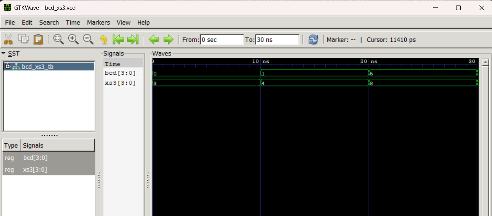
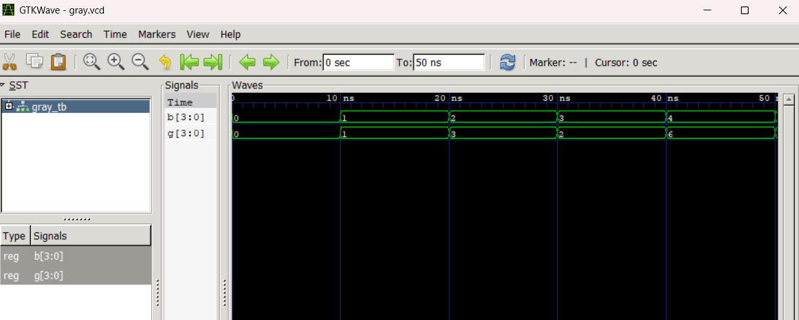

# Lab 6: VHDL Code for Code Converters (BCD-to-Excess3 and Binary-to-Gray)

---

## Objective

- Develop and verify a **BCD-to-Excess-3 (XS-3) code converter** using VHDL.
- Develop and verify a **4-bit Binary-to-Gray code converter** using VHDL.

---

## Theory

### BCD-to-Excess-3 Conversion

Excess-3 (XS-3) is a non-weighted decimal encoding format created by adding a constant value of 3 (`0011` in binary) to every standard BCD digit. The code features a self-complementing characteristic and was widely utilized in vintage decimal processing systems.

| BCD (Decimal) | BCD Code | XS-3 Code |
| ------------- | -------- | --------- |
| 0             | 0000     | 0011      |
| 1             | 0001     | 0100      |
| 5             | 0101     | 1000      |
| 9             | 1001     | 1100      |

### Binary-to-Gray Conversion

Gray code is a binary numbering sequence in which adjacent values differ by exactly one bit position. For a 4-bit conversion, the output bits are generated through the following XOR operations:

- G(3) = B(3)
- G(2) = B(3) XOR B(2)
- G(1) = B(2) XOR B(1)
- G(0) = B(1) XOR B(0)

| Binary (B) | Gray (G) |
| ---------- | -------- |
| 0000       | 0000     |
| 0001       | 0001     |
| 0010       | 0011     |
| 0011       | 0010     |
| 0100       | 0110     |
| 1111       | 1000     |

---

## VHDL Source Code

### BCD-to-Excess-3 Converter (`bcd_to_xs3.vhd`)

```vhdl
library IEEE;
use IEEE.STD_LOGIC_1164.ALL;
use IEEE.NUMERIC_STD.ALL;

entity BCD_TO_XS3 is
    port(
        BCD : in std_logic_vector(3 downto 0);
        XS3 : out std_logic_vector(3 downto 0)
    );
end entity BCD_TO_XS3;

architecture Behavioral of BCD_TO_XS3 is
begin
    process(BCD)
    begin
        XS3 <= std_logic_vector(unsigned(BCD) + 3);
    end process;
end architecture Behavioral;
```

### Binary-to-Gray Converter (`bin_to_gray.vhd`)

```vhdl
library IEEE;
use IEEE.STD_LOGIC_1164.ALL;

entity BIN_TO_GRAY is
    port(
        B : in std_logic_vector(3 downto 0);
        G : out std_logic_vector(3 downto 0)
    );
end entity BIN_TO_GRAY;

architecture Dataflow of BIN_TO_GRAY is
begin
    G(3) <= B(3);
    G(2) <= B(3) xor B(2);
    G(1) <= B(2) xor B(1);
    G(0) <= B(1) xor B(0);
end architecture Dataflow;
```

---

## Simulation Setup

All simulations were executed with **GHDL**, and resulting waveforms were inspected using **GTKWave**.

### Terminal Commands

**BCD-to-Excess-3:**

```bash
ghdl -a bcd_to_xs3.vhd bcd_xs3_tb.vhd
ghdl -e BCD_XS3_TB
ghdl -r BCD_XS3_TB --vcd=bcd_xs3.vcd
gtkwave bcd_xs3.vcd
```

**Binary-to-Gray:**

```bash
ghdl -a bin_to_gray.vhd gray_tb.vhd
ghdl -e GRAY_TB
ghdl -r GRAY_TB --vcd=gray.vcd
gtkwave gray.vcd
```

---

## Simulation Results

### BCD-to-Excess-3 Waveform

The testbench applies a sequence of BCD inputs, holding each for a 10 ns interval, while capturing the resulting XS-3 output.

| Time     | BCD[3:0] | XS3[3:0]  |
| -------- | -------- | --------- |
| 0–10 ns  | 0000 (0) | 0011 (3)  |
| 10–20 ns | 0001 (1) | 0100 (4)  |
| 20–30 ns | 0101 (5) | 1000 (8)  |
| 30–40 ns | 1001 (9) | 1100 (12) |



---

### Binary-to-Gray Waveform

The testbench cycles through five binary inputs at 10 ns intervals, recording the corresponding Gray code outputs.

| Time     | B[3:0]   | G[3:0]   |
| -------- | -------- | -------- |
| 0–10 ns  | 0000 (0) | 0000 (0) |
| 10–20 ns | 0001 (1) | 0001 (1) |
| 20–30 ns | 0010 (2) | 0011 (3) |
| 30–40 ns | 0011 (3) | 0010 (2) |
| 40–50 ns | 0100 (4) | 0110 (6) |



---

## Conclusion

The VHDL implementations for both the BCD-to-Excess-3 and 4-bit Binary-to-Gray converters were successfully completed and verified. The BCD-to-XS3 module was constructed using a behavioral modeling style with direct arithmetic addition, while the Binary-to-Gray module utilized a dataflow architecture based on XOR logic. Waveform analysis via GHDL and GTKWave demonstrates that both circuits accurately produce the expected outputs across all tested input conditions, confirming alignment with their respective theoretical conversion tables.
