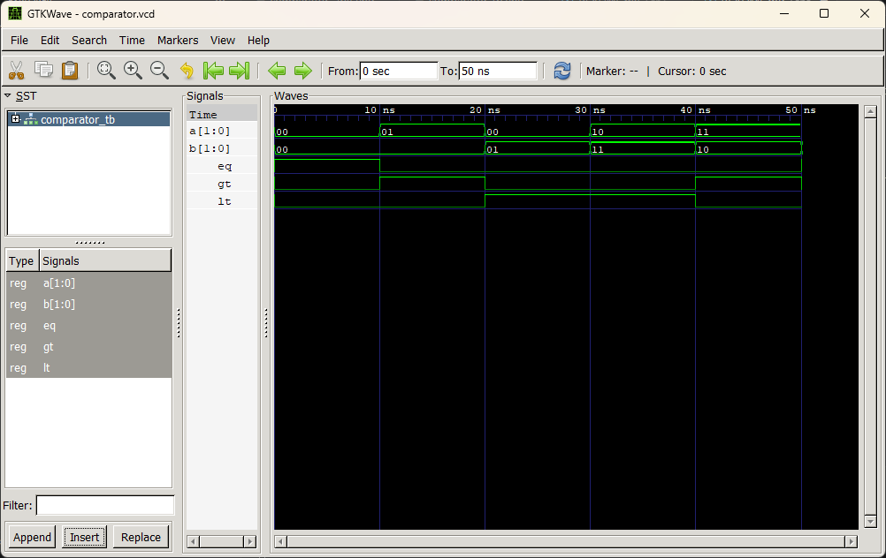

# Lab 5: VHDL Code for Combinational Circuits: Comparator

## Overview

This repository contains the VHDL implementation, testbench, and simulation results for a **2-bit magnitude comparator**. The project demonstrates how fundamental comparison operations are translated from theoretical Boolean logic into synthesizable hardware description language (HDL) code.

---

## Objectives

The primary goals of this laboratory exercise are to:

- Design, code, and simulate a 2-bit magnitude comparator using VHDL.
- Translate theoretical Boolean equations into hardware-level VHDL constructs (Dataflow/Behavioral modeling).
- Understand the underlying hardware architecture required for binary comparison operations.
- Verify the functional correctness of the design using waveform analysis and truth table validation.

---

## Theory

A magnitude comparator is a combinational logic circuit that compares two binary numbers, $A$ and $B$, and determines their relative magnitude. For a 2-bit comparator, the inputs are $A = A_1A_0$ and $B = B_1B_0$.

The circuit yields three mutually exclusive outputs:

- **EQ (Equal):** Asserted HIGH when $A = B$
- **GT (Greater Than):** Asserted HIGH when $A > B$
- **LT (Less Than):** Asserted HIGH when $A < B$

### Boolean Logic Equations

_(Note: $\odot$ represents the XNOR operation)_

1. **Equality (EQ):** Both bits must be equal.
   $$EQ = (A_1 \odot B_1) \cdot (A_0 \odot B_0)$$

2. **Greater Than (GT):** The most significant bit (MSB) of A is greater, OR the MSBs are equal and the least significant bit (LSB) of A is greater.
   $$GT = A_1\overline{B_1} + (A_1 \odot B_1)A_0\overline{B_0}$$

3. **Less Than (LT):** The MSB of A is less, OR the MSBs are equal and the LSB of A is less.
   $$LT = \overline{A_1}B_1 + (A_1 \odot B_1)\overline{A_0}B_0$$

### Truth Table

| $A_1$ | $A_0$ | $B_1$ | $B_0$ | **EQ** | **GT** | **LT** |
| :---: | :---: | :---: | :---: | :----: | :----: | :----: |
|   0   |   0   |   0   |   0   | **1**  |   0    |   0    |
|   0   |   0   |   0   |   1   |   0    |   0    | **1**  |
|   0   |   1   |   0   |   0   |   0    | **1**  |   0    |
|   0   |   1   |   0   |   1   | **1**  |   0    |   0    |
|   0   |   1   |   1   |   0   |   0    |   0    | **1**  |
|   0   |   1   |   1   |   1   |   0    |   0    | **1**  |
|   1   |   0   |   0   |   0   |   0    | **1**  |   0    |
|   1   |   0   |   0   |   1   |   0    | **1**  |   0    |
|   1   |   0   |   1   |   0   | **1**  |   0    |   0    |
|   1   |   0   |   1   |   1   |   0    |   0    | **1**  |
|   1   |   1   |   0   |   0   |   0    | **1**  |   0    |
|   1   |   1   |   0   |   1   |   0    | **1**  |   0    |
|   1   |   1   |   1   |   0   |   0    | **1**  |   0    |
|   1   |   1   |   1   |   1   | **1**  |   0    |   0    |

---

## VHDL Source Code

### 1. Main Design Entity (`COMPARATOR_2BIT`)

This is the core behavioral model of the 2-bit comparator. It utilizes the `NUMERIC_STD` library to perform unsigned integer comparisons on the input vectors.

```vhdl
library IEEE;
use IEEE.STD_LOGIC_1164.ALL;
use IEEE.NUMERIC_STD.ALL;

entity COMPARATOR_2BIT is
    port(
        A: in std_logic_vector(1 downto 0);
        B: in std_logic_vector(1 downto 0);
        EQ: out std_logic;
        GT: out std_logic;
        LT: out std_logic
    );
end entity COMPARATOR_2BIT;

architecture Behavioral of COMPARATOR_2BIT is
begin
    process(A,B)
    begin
        if unsigned(A) = unsigned(B) then
            EQ <= '1'; GT <= '0'; LT <= '0';
        elsif unsigned(A) > unsigned(B) then
            EQ <= '0'; GT <= '1'; LT <= '0';
        else
            EQ <= '0'; GT <= '0'; LT <= '1';
        end if;
    end process;
end architecture Behavioral;
```

### 2. Testbench (`COMPARATOR_TB`)

The testbench instantiates the Unit Under Test (UUT) and applies a stimulus process to verify all three output conditions (Equal, Greater Than, Less Than).

```vhdl
library IEEE;
use IEEE.STD_LOGIC_1164.ALL;

entity COMPARATOR_TB is
end entity COMPARATOR_TB;

architecture Simulation of COMPARATOR_TB is
    signal A, B : std_logic_vector(1 downto 0) := "00";
    signal EQ, GT, LT: std_logic;
begin
    -- Instantiate the Unit Under Test (UUT)
    DUT: entity work.COMPARATOR_2BIT
    port map(A => A, B => B, EQ => EQ, GT => GT, LT => LT);

    -- Stimulus process
    STIMULUS: process
    begin
        A <= "00"; B <= "00"; wait for 10 ns ; -- EQ = 1
        A <= "01"; B <= "00"; wait for 10 ns ; -- GT = 1
        A <= "00"; B <= "01"; wait for 10 ns ; -- LT = 1
        A <= "10"; B <= "11"; wait for 10 ns ; -- LT = 1
        A <= "11"; B <= "10"; wait for 10 ns ; -- GT = 1
        A <= "11"; B <= "11"; wait for 10 ns ; -- EQ = 1
        wait;
    end process;
end architecture Simulation;
```

---

## Simulation Results


_Figure 1: Simulation waveform demonstrating the comparator's response to varying 2-bit inputs._

**Key Observations from Waveforms:**

- The outputs **EQ, GT,** and **LT** are strictly mutually exclusive; exactly one output is HIGH for any given input state.
- Transitions between states occur cleanly without glitches, confirming proper combinational logic synthesis.
- The simulated outputs perfectly match the theoretical truth table and the expected testbench assertions.

---

## Discussion

In this lab, we successfully modeled a 2-bit comparator in VHDL. The exercise highlighted several critical concepts in digital design:

1. **Hardware Mapping:** It demonstrated how abstract mathematical equations are directly mapped to logic gates (AND, OR, NOT, XNOR) during the synthesis process, or how behavioral `if-else` statements translate to multiplexer trees in hardware.
2. **Mutual Exclusivity:** The logic ensures that the three output states form a "one-hot" encoded result, which is crucial for downstream digital systems to avoid conflicting control signals.
3. **Scalability:** While this lab focused on a 2-bit design, the hierarchical nature of VHDL allows these 2-bit blocks to be cascaded to create 4-bit, 8-bit, or 32-bit comparators (similar to the 74LS85 IC).

---

## Conclusion & Real-World Applications

This experiment reinforced the foundational role of **combinational logic** in digital systems. By designing and verifying a magnitude comparator, we gained practical experience in VHDL coding, testbench creation, and waveform analysis.

**Real-World Relevance:**
Comparators are not just theoretical exercises; they are fundamental building blocks in modern computing. They are heavily utilized in:

- **Arithmetic Logic Units (ALUs):** To evaluate conditional branches (e.g., `if A > B` in assembly language).
- **Memory Controllers:** For address decoding and boundary checking.
- **Sorting Hardware:** To determine the relative order of data packets in high-speed network routers.

---

## How to Simulate

1. Open your preferred VHDL simulator (e.g., ModelSim, Vivado, Quartus, or GHDL).
2. Compile the `comparator_2bit.vhd` design file.
3. Compile the `comparator_tb.vhd` testbench file.
4. Run the simulation and observe the waveform to verify the 6 targeted input states.
